# Surveillance applicative avec Prometheus

## Introduction

Prometheus est un outil de surveillance applicative très connu dans le domaine de l'observabilité.

<br>

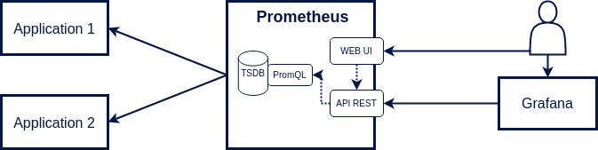

<br>

L'outil fonctionne en mode `Pull`, c'est à dire qu'il collecte les métriques à intervalle régulier auprès des applications à surveiller. Ces métriques sont ensuite enregistrées dans une base de données temporelles.

Le langage de requête **PromQL** sera utilisé pour requêter les données par le biais d'une API Rest.

Globalement, Prometheus regroupe :

- un outil pour collecter les métriques.
- une base de données temporelles (Time Series DataBase).
- un langage de requête (PromQL).
- une API Rest pour exécuter les requêtes et gérer la plateforme.
- une interface graphique pour visualiser les données.

Il est recommandé d'utiliser [**Grafana**](https://grafana.com/grafana/) pour l'affichage des données. 
L'interface minimaliste de Prometheus doit être consacrée uniquement aux tests de validité des requêtes PromQL.

## Types de métriques

Une métrique est une mesure numérique d'un élement applicatif, par exemple la quantité de mémoire RAM utilisée. <br>
Elles se déclinent principalement en quatre types.

**Compteur**

La valeur d'un compteur peut **uniquement être incrémentée**.

<ins>Exemple</ins> : Nombre de requêtes HTTP executées par un serveur web.

<br>


<br>

**Jauge**

La valeur d'une jauge peut **augmenter ou diminuer**.

<ins>Exemple</ins> : Température d'un processeur en degré celcius.

<br>

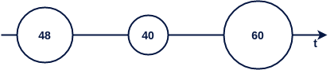

<br>

**Histogramme**

Un histogramme compte le nombre de données par catégories.

<ins>Exemple</ins> : Durée d'exécution des requêtes HTTP.

<br>

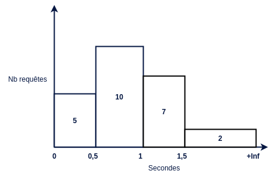

<br>

10 requêtes ont un temps d'exécution compris entre 0,5 et 1 seconde.

Comme pour un compteur, le nombre de requêtes de chaque catégorie pourra uniquement augmenter au cours du temps.

**Résumé**

Un résumé permet de calculer la valeur de certains quantiles.

<ins>Exemple</ins> : Durée d'exécution des requêtes HTTP.

<br>

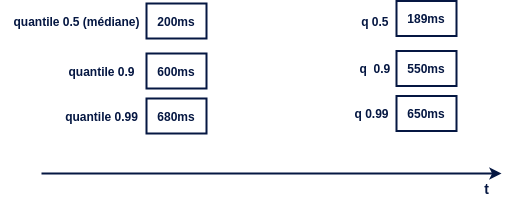

<br>

Au vu du dernier résultat, on déduit que le temps d'exécution d'une requête est inférieur ou égal à 650ms pour au moins 99% d'entre elles. Le temps d'exécution médian est quant à lui égal à 189ms.

Pour rappel, un quantile de rang q (0 <= q <= 1) d'une série ordonnée d'éléments permet d'évaluer la valeur d'un élément pour un rang donné.<br>
Par exemple, le quantile 0,5 également appelé médiane permet de séparer une série en deux parties. Sa valeur, contrairement à la moyenne, ne sera pas affectée par des valeurs disproportionnées présentes dans un jeu de données.

<br>

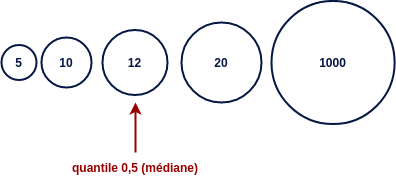


## Format des métriques

Les applications doivent exposer leurs métriques par le biais d'un service HTTP de type GET.<br> 
Ce service retourne l'intégralité des métriques dans un format texte compréhensible par Prometheus.

<b>Compteur</b>

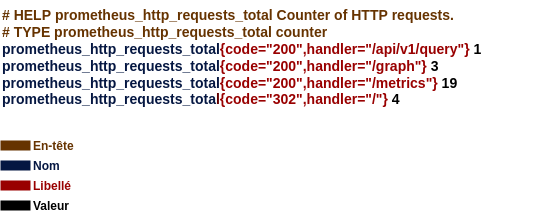

Chaque ligne (sauf les en-têtes) définit une série temporelle identifiée par son **nom** et des **libellés** de type clé-valeur. Une métrique correspond donc à un ensemble de séries temporelles.

Par convention, le nom d'un compteur se terminera toujours par `_total`.

<b>Jauge</b>

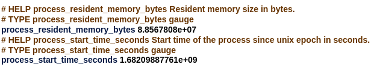

La première jauge `process_resident_memory_size` indique la taille mémoire occupée par le processus. Cette valeur peut augmenter ou diminuer au fil du temps.

On peut également se servir d'une jauge pour définir une constante, c'est le cas de `process_start_time_seconds` qui indique la date de démarrage du processus. Cette donnée n'évolue pas tant que l'application ne redémarre pas.

Une métrique doit obligatoirement avoir un nom. Elle peut en revanche ne pas avoir de libellé, c'est le cas pour ces deux jauges. 

<b>Histogramme</b>

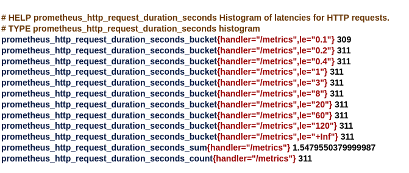

Un histogramme est composé de plusieurs séries temporelles. 

Premièrement, on a les séries correspondantes aux différentes catégories de l'histogramme. Leur nom se termine par `_bucket`. Chacune de ces séries contient obligatoirement le libellé `le` (lower or equal).<br>
La première catégorie indique que 309 requêtes ont eu une durée d'exécution inférieure ou égale 0,1s.<br>
Les valeurs présentent de chaque catégorie sont cummulatives, on en déduit que 2 requêtes ont eu une durée d'exécution comprise entre 0,1s et 0,2s.<br>
La derniere catégorie possède obligatoirement le libellé `le="+Inf"`.

On trouve ensuite deux séries correspondantes à la somme et au nombre de valeurs enregistrées. 311 requêtes ont été exécutées pour une durée totale de 1,55s. Cela permet de calculer la moyenne.

Chaque service (identifié par le libellé `handler`) contiendra ce même ensemble de séries. J'ai affiché ici uniquement les séries liées au service `/metrics`, on retrouvera les mêmes séries pour les autres services (`/graph`, `/api/v1/query` etc...).

<b>Résumé</b>

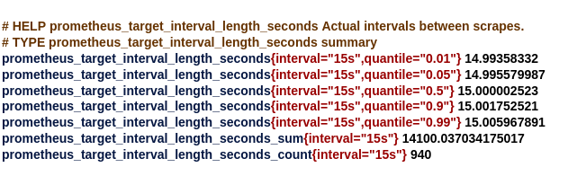

On a une série par quantile. Par défaut, Prometheus récupère les métriques toutes les 15 secondes. Les valeurs sont ici toutes très proches de 15.

Comme pour l'histogramme, deux séries correspondent à la somme et au nombre de valeurs enregistrées.

Les quantiles sont calculés par l'application cliente à chaque nouvel enregistrement. Pour obtenir leur valeur exacte, il faudrait garder en mémoire l'intégralité du jeu de données, ce qui n'est pas envisageable pour une application avec une durée de vie importante.<br>
Un algorithme est utilisé pour éliminer certaines données au fil du temps. Les calculs des quantiles sont donc effectués en intégrant une marge d'erreur.

## Exposition des métriques

Pour créer et exposer les métriques d'une application, on peut :

- utiliser un exporter qui va venir s'intégrer à celle-ci.

- déclarer ses propres métriques en ajoutant du code à l'application.<br> Prometheus fournit des libraries dans plusieurs langages à ce sujet.

Un exporter permet d'observer un système existant sans avoir à ajouter le moindre code.

* [`Node exporter`](https://github.com/prometheus/node_exporter) expose les métriques d'un système Linux.
* [`JMX exporter`](https://github.com/prometheus/jmx_exporter) expose les métriques d'une application Java en se basant sur les données disponibles via JMX.
* [`PostgreSQL exporter`](https://github.com/prometheus-community/postgres_exporter) expose les métriques d'une base de données PostgreSQL.

Le serveur Prometheus expose également des métriques, il peut donc s'observer lui-même.

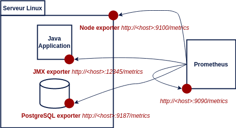

## Collecte des métriques

Les applications à observer seront déclarées dans le fichier de configuration `prometheus.yml`.

```yaml
global:
  scrape_interval: 15s

scrape_configs:
  - job_name: "prometheus"
    # metrics_path defaults to '/metrics'
    # scheme defaults to 'http'.
    static_configs:
      - targets: ["localhost:9090"]
  - job_name: "node"
    static_configs:
      - targets: ["localhost:9100"]
```

`job_name` représente le nom de l'application. Le tableau `targets` liste les instances sur laquelle l'application est déployée.

Sur cet exemple, Prometheus collectera toutes les 15 secondes :
- ses propres métriques => `http://localhost:9090/metrics` 
- les métriques d'un serveur linux => `http://localhost:9100/metrics`

Pour une utilisation plus poussée, il sera préférable d'utiliser la découverte de service pour récupérer la liste des instances dynamiquement. 

Une fois les données récupérées, Prometheus les enregistre dans sa base sous forme de séries temporelles.<br>

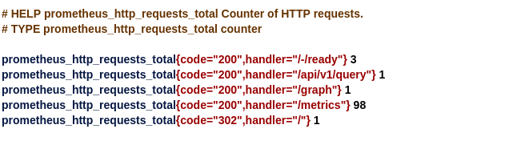

L'exemple précédent produira cinq séries dans Prometheus, les libellés `job` et `instance` seront automatiquement ajoutés à chacune d'entre elles lors de leur création. Toutes les 15 secondes un nouvel enregistrement (représenté par une valeur horodatée) sera inséré pour chaque série.<br>

<ins>Représentation d'une série temporelle :</ins>

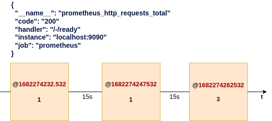

Il est primordial de définir un intervalle de temps assez court pour la récupération des métriques afin de ne pas passer à côté de valeurs importantes.

Par défaut, Prometheus conservera les données pendant 15 jours, cette valeur est configurable en utilisant l'option `--storage.tsdb.retention.time` lors du démarrage de Prometheus.

## Lecture des métriques

La lecture des données est essentielle pour analyser la santé d'une application. C'est également la partie la plus complexe à appréhender, le langage PromQL (Prometheus Query Language) bien que très complet reste difficile à maîtriser.

L'exécution d'une requête PromQL dans Prometheus s'effectue au travers d'une API Rest. Un simple client http est donc suffisant pour lire les données enregistrées dans Prometheus.

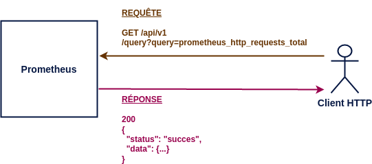

### API Query

Le service Rest `query` permet d'exécuter une requête PromQL. Celle-ci peut se décliner en deux catégories.

<b>1) <ins>requête à un instant précis</ins></b> (`instant_query`)

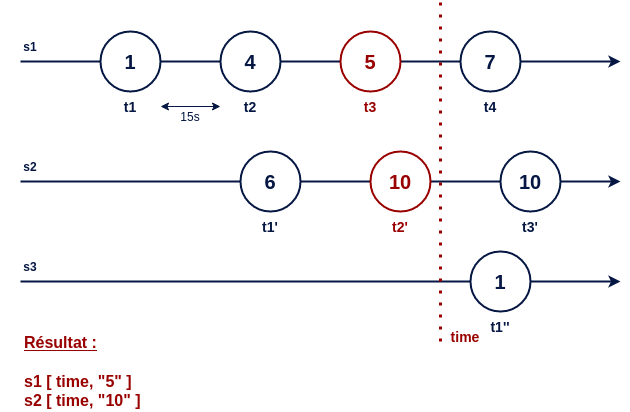

Le résultat contient une seule valeur par série. C'est la valeur la plus récente par rapport à l'instant d'évaluation qui est retournée.

<ins>Appel REST</ins>

**GET /api/query?query=prometheus_http_requests_total&time=1682358304.676**

*La date courante est utilisée si le paramètre time n'est pas fourni.*

<pre>
{
  "status":"success",
  "data":{
    "resultType":"vector",
    "result":[
    {
      "metric":{
        "__name__":"prometheus_http_requests_total",
        "code":"200",
        "handler":"/-/ready",
        "instance":"localhost:9090",
        "job":"prometheus"
      },
      "value":[1682358304.676,"1"]
    },
    {
      "metric":{
        "__name__":"prometheus_http_requests_total",
        "code":"200",
        "handler":"/api/v1/query",
        "instance":"localhost:9090",
        "job":"prometheus"
      },
      "value":[1682358304.676,"2"]
    },
    ...
    ]
  }
}
</pre>

On obtient en résultat une liste de séries identifiées par un nom et des libellés. Chacune d'elles possède une seule valeur horodatée représenté par le champ `value`. L'horodatage est égal à la date d'évaluation (le paramètre `time`), il est donc identique pour tous les résultats.

<ins>Affichage dans Prometheus</ins> (`http://localhost:9090/graph`)

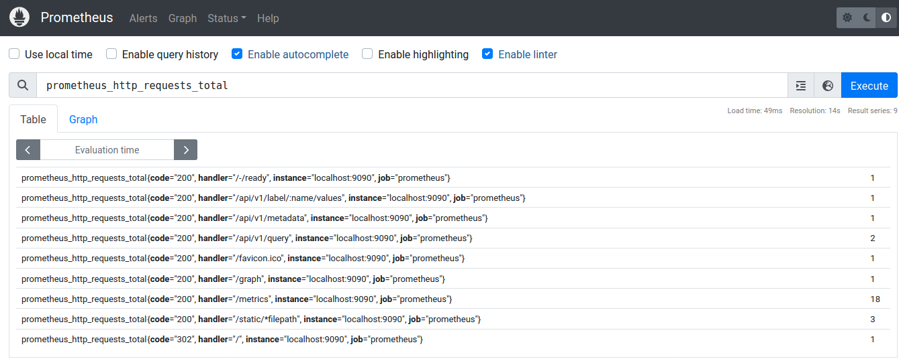
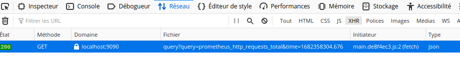

<b>2) <ins>requête sur un intervalle de temps</ins></b>  (`range_query`)


Le résultat contient pour chaque série l'ensemble des valeurs présentes dans l'intervalle de temps.

<ins>Appel REST</ins>

**GET /api/query?query=prometheus_http_requests_total[1m]&time=1682778791.976**

L'intervalle de temps est défini entre crochets.

<pre>
{
  "status":"success",
  "data":{
    "resultType":"matrix",
    "result":[
    {
      "metric":{
        "__name__":"prometheus_http_requests_total",
        "code":"200",
        "handler":"/-/ready",
        "instance":"localhost:9090",
        "job":"prometheus"
      },
      "values":[
        [1682778742.532,"1"],
        [1682778757.532,"1"],
        [1682778772.532,"1"],
        [1682778787.532,"1"]
      ]
    },
    ...
    ]
  }
}
</pre>

On obtient en résultat une liste de séries, l'ensemble des valeurs horodatées appartenant à l'intervalle sont retournées dans le champs `values`. Cette fois-ci, les dates correspondent aux temps d'enregistrement présents en base, elles pourront varier suivant les séries.

<ins>Affichage dans Prometheus</ins> (`http://localhost:9090/graph`)

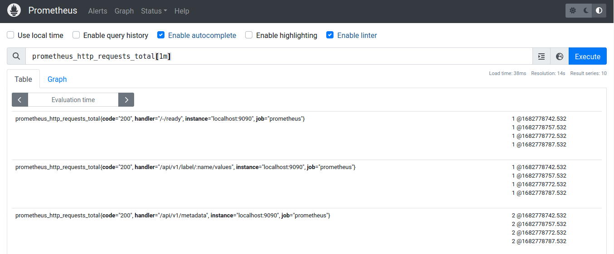
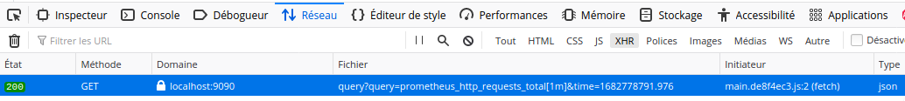

### Filtre et Aggrégation

PromQL offre la possibilité de filtrer et d'aggréger les résultats. Les fonctions d'aggrégation (`sum`, `count`, `avg`, `min`, `max` etc...) s'appliquent uniquement à des requêtes de type `instant_query`.

Les exemples suivant s'appuie sur ce jeu de données :

**prometheus_http_requests_total**

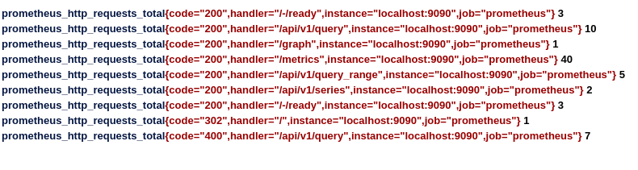

<ins>Nombre de requêtes http pour le service /metrics et le code retour 200</ins>

**prometheus_http_requests_total{code="200", handler="/metrics"}**


Les filtres sont définis entre accolades, ils s'appliquent aux libellés de la série.

<ins>Nombre de séries avec le nom prometheus_http_requests_total</ins>

**count(prometheus_http_requests_total)**

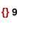

On compte ici le nombre de séries dont le nom est égal à  `prometheus_http_requests_total`. L'utilisation d'une fonction d'aggrégation supprime le nom et les libellés du résultat.

<ins>Nombre de séries regroupées par code retour</ins>

**count by (code) (prometheus_http_requests_total)**

ou

**count without (handler, instance, job) (prometheus_http_requests_total)**

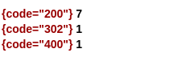

Les mots-clés `by` et `without` permettent d'aggréger les données par groupe de libellés, ces derniers seront inclus dans le résultat.

<ins>Somme du nombre de requêtes http</ins>

**sum(prometheus_http_requests_total)**

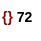

<ins>Somme du nombre de requêtes http par code retour</ins>

**sum by code (prometheus_http_requests_total)**

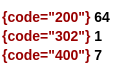

<ins>Nombre moyen de requêtes http par série</ins>

**avg(prometheus_http_requests_total)**


### Opération arithmétique

Les opérateurs `+`, `-`, `*`, `/`, `%` et `^` peuvent être utilisées pour effectuer des opérations arithmétiques entre deux requêtes de type `instant_query`.

La moyenne obtenue précédemment correspond à cette division :

**sum(prometheus_http_requests_total) / count(prometheus_http_requests_total)**
```
{} 30.5
```

Pour obtenir un résultat lors d'une opération arithmétique, il faut avoir une correspondance un à un, c'est à dire qu'une ligne à gauche doit correspondre avec une ligne à droite. <br>
Cette correspondance s'applique sur les libellés, le nom de la métrique est ignoré, il n'est d'ailleurs pas présent dans le résultat.

**go_gc_duration_seconds + go_gc_duration_seconds**

// TODO, montrer la correspondance

Par défaut la correspondance utilise tous les libellés, il est possible de préciser sur quels libellés doit être effectuée la correspondance en utilisant `on` ou `ignoring`.

**go_gc_duration_seconds + on(instance, job, quantile) prometheus_engine_query_duration_seconds{slice="inner_eval"}**

**go_gc_duration_seconds + ignoring(slice) prometheus_engine_query_duration_seconds{slice="inner_eval"}**

Nous allons écrire une requête un plus complexe qui déterminera la proportion de requêtes http par code retour.<br> Pour une application en bonne santé, on s'attend à ce que la majorité des requêtes exécutées aient un code retour égal à 200.

<ins>Nombre de requêtes http par code, instance et job</ins>

**sum by (code, instance, job) (prometheus_http_requests_total)**
```
{code="200", instance="localhost:9090", job="prometheus"} 712
{code="302", instance="localhost:9090", job="prometheus"} 1
{code="400", instance="localhost:9090", job="prometheus"} 11
{code="422", instance="localhost:9090", job="prometheus"} 3
```

On regroupe également les résultats par instance et job dans l'hypothèse où prometheus pourrait être déployé sur plusieurs instances.

<ins>Nombre de requêtes http par instance et job</ins>

**sum by (instance, job) (prometheus_http_requests_total)**
```
{instance="localhost:9090", job="prometheus"} 725
```
On a ici le nombre total de requêtes http par instance et pa job.

Pour obtenir le résultat escompté, il faudra effectuer une division. L'utilisation de `on(instance, job)` permet de faire la correspondance sur les deux libellés en commun, cela n'est cependant pas suffisant.

Nous avons ici une correspondance plusieurs pour un, c'est à dire que plusieurs lignes du premier résultat sont associées à une seule ligne du second résultat. Il faudra le préciser dans la requête PromQL en utilisant le mot-clé `group_left`.

<ins>Proportion de requêtes http par code, instance et job</ins>

**sum by (code, instance, job) (prometheus_http_requests_total) / on(instance, job) group_left sum by(instance, job) (prometheus_http_requests_total)**
```
{code="200", instance="localhost:9090", job="prometheus"} 98.03664921465969
{code="302", instance="localhost:9090", job="prometheus"} 0.13089005235602094
{code="400", instance="localhost:9090", job="prometheus"} 1.4397905759162304
{code="422", instance="localhost:9090", job="prometheus"} 0.3926701570680628
```

Une opération arithmétique peut également être effectuée entre une série et un nombre. La multiplication de ces résultats par 100 nous donne un poucentage.

<ins>Pourcentage de requêtes http par code, instance et job</ins>

**(sum by (code, instance, job) (prometheus_http_requests_total) / on(instance, job) group_left sum by(instance, job) (prometheus_http_requests_total)) * 100**
```
{code="200", instance="localhost:9090", job="prometheus"} 98.03664921465969
{code="302", instance="localhost:9090", job="prometheus"} 0.13089005235602094
{code="400", instance="localhost:9090", job="prometheus"} 1.4397905759162304
{code="422", instance="localhost:9090", job="prometheus"} 0.3926701570680628
```

Il est donc par défaut nécessaire d'avoir une correspondance un pour un entre deux séries pour effectuer une opération arithmétique. Une correspondance plusieurs pour un ou un pour plusieurs pourra être appliquée en utilisant respectivement `group_left` et `group_right`. En revanche, une correspondance plusieurs pour plusieurs est en interdite par Prometheus.

// TODO montrer schéma.

### Fonction Rate

Le résultat précédent semble satisfaisant, il s'avère en réalité inexploitable pour déterminer la santé de l'application à un instant donné :

* Sur une application démarrée depuis longtemps, si la majorité des requêtes s'est exécutée correctement, un problème d'exécution des requêtes sur les dernières minutes ne sera pas visible.

// TODO montrer schéma

* Si l'application redémarre, les compteurs seront réinitialisés à 0. Les données avant redémarrage ne sont pas utilisées par la requête.

// TODO montrer schéma

La fonction `rate` permet de résoudre cette problématique, ell calcule le taux d'accroissement par seconde d'un compteur sur une période donnée. 

// TODO montrer schéma

Cette fonction prend en paramètre un `range_vector` et retourne un `instant_vector`.

En reprenant l'exemple précédent avec l'utilisation cette fois-ci de la fonction `rate` sur une période de 15 minutes, on obtient :

<ins>requête 1</ins>

**sum by (code, instance, job) (rate(prometheus_http_requests_total[15m]))**

<ins>requête 2</ins>

**sum by (instance, job) (rate(prometheus_http_requests_total[15m]))**

<ins>requête finale</ins>

**(sum by (code, instance, job) (rate(prometheus_http_requests_total[15m])) / on(instance, job) group_left sum by(instance, job) (rate(prometheus_http_requests_total[15m]))) * 100**

Cette requête donne un indicateur sur l'exécution des requêtes dans les 15 dernières minutes. Le résultat obtenu reste fiable même en cas de redémarrage de l'application.

L'utilisation de `rate` sera quasi systémtique dès lors que l'on manipule un compteur. Elle devra uniquement être utilisée sur une métrique dont la valeur augmente au cours du temps. L'utilisation de `rate` sur une jauge est inappropriée.

Une fonction similaire `increase` qui mesure l'accroissement d'un comtpeur sur une période donnée en tenant compte d'un éventuel redémarrage.

// TODO montrer schéma

Pour une jauge on utilisera `delta` pour calculer la différentce ente deux points.

### API Query Range

Ce service évalue une requête pour un ensemble de dates sur un intervalle de temps. Il est principalement utilisé pour la construction de graphes.

// Montrer schéma

Ce service accepte uniquement des requêtes de type `instant_query`.

=> différence et similitude entre `prometheus_http_requests_total{handler="/metrics"}` et `prometheus_http_requests_total{handler="/metrics"}[10m]`

api_range évalue le résultat de la requête pour chacun des points de l'intervalle, la requête doit retourner obligatoire un chiffre. L'utilisation d'une requête de type `range_query` qui retourne un tableau n'est donc pas approprié.

Comme je le disais la lecture des données dans Prometheus est extrèmement complexe. Maitriser le language PromQL nécessite de la pratique.

=> Donner exemple de requête pour construire graphes dans Grafana.
