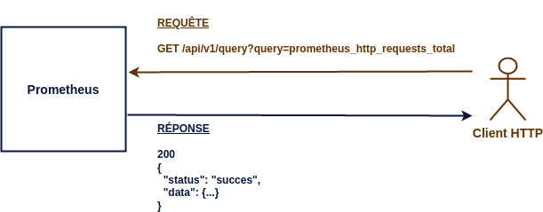
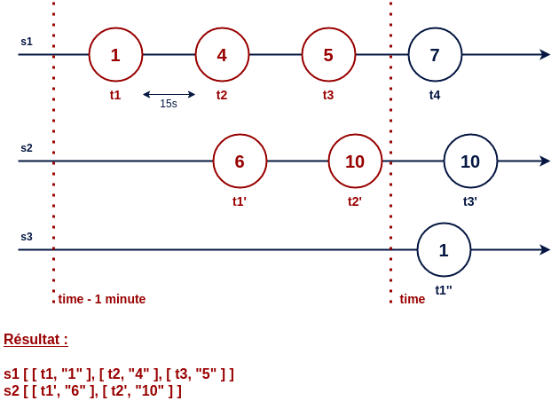

# Surveillance applicative avec Prometheus

## Introduction

Prometheus est un outil de surveillance applicative très connu dans le monde de l'observabilité.

<br>


<br>

Prometheus fonctionne en mode `Pull`, il collecte les métriques à intervalle régulier auprès des applications à surveiller.<br>
Ces métriques sont ensuite enregistrées dans une base de données temporelles.<br>
Le langage **PromQL** permettra de requêter les données par le biais d'une API Rest.

On retrouve dans Prometheus :

- un outil pour collecter les métriques.
- une base de données temporelles (Time Series DataBase).
- un langage de requête (PromQL).
- une API Rest pour exécuter les requêtes et gérer la plateforme.
- une interface graphique pour visualiser les données.

Il est recommandé d'utiliser **Grafana** pour l'affichage des données. 
L'interface minimaliste de Prometheus sera utilisée uniquement dans la phase de développement pour tester des requêtes PromQL.

## Types de métriques

Une métrique est une mesure numérique d'un élement de l'application, par exemple la quantité de mémoire RAM utilisée. <br>
Elles se déclinent  principalement en quatre types.

**Compteur**

La valeur d'un compteur peut **uniquement être incrémentée**.

<ins>Exemple</ins> : Nombre de requêtes HTTP executées par un serveur web.

<br>


<br>

**Jauge**

La valeur d'une jauge peut **augmenter ou diminuer**.

<ins>Exemple</ins> : Température d'un processeur en degré celcius.

<br>


<br>

**Histogramme**

Un histogramme compte le nombre de données selon certaines catégories prédéfinies.

<ins>Exemple</ins> : Durée d'exécution des requêtes HTTP.

<br>


<br>

10 requêtes ont un temps d'exécution compris entre 0,5 et 1 seconde.

Le nombre de requêtes de chaque catégorie augmentera au cours du temps. Comme pour un compteur, cette valeur ne pourra pas diminuer.

**Résumé**

Un résumé permet de calculer la valeur de certains quantiles.

<ins>Exemple</ins> : Durée d'exécution des requêtes HTTP.

<br>


<br>

Au vu du dernier résultat, on déduit que le temps d'exécution d'une requête est inférieur ou égal à 650ms pour au moins 99% d'entre elles. <br>
Le temps d'exécution médian est égal à 189ms.

Un quantile de rang q (0 <= q <= 1) d'une série ordonnée d'éléments permet d'évaluer la valeur d'un élément à un rang donné.<br>

Par exemple, le quantile 0,5 également appelé médiane permet de séparer une série en deux parties. Sa valeur, contrairement à la moyenne, ne sera pas affectée par des valeurs disproportionnées présentes dans le jeu de données.

<br>


## Format des métriques

Les applications doivent exposer leurs métriques par le biais d'un service HTTP de type GET.<br> 
Ce service retournera l'intégralité des métriques dans un format texte compréhensible par Prometheus.

<b>Compteur</b>


Chaque ligne (excepté les en-têtes) définit une nouvelle série temporelle qui est identifiée par son **nom** et éventuellement des **libellés** de type clé-valeur. Une métrique correspond donc à un ensemble de séries temporelles.

Par convention, le nom d'un compteur se terminera toujours par `_total`.

<b>Jauge</b>


La première jauge `process_resident_memory_size` indique la taille mémoire occupée par le processus. Cette valeur pourra augmenter ou diminuer.

Une jauge peut également servir à stocker une constante, c'est le cas de `process_start_time_seconds` qui indique la date de démarrage du processus.

Une métrique doit obligatoirement avoir un nom. Elle peut en revanche ne pas avoir de libellés, c'est le cas pour ces deux jauges.   

<b>Histogramme</b>


Un histogramme est composé de plusieurs séries temporelles. 

On a dans un premier temps les séries correspondantes aux catégories de l'histogramme. Leur nom se termine par `_bucket`. Chacune de ces séries contient obligatoirement le libellé `le` (lower or equal).<br>

La première catégorie nous indique que 309 requêtes ont eu une durée d'exécution inférieure ou égale 0,1s.<br>

Les valeurs présentent dans ces catgégores sont cummulatives, on en déduit que 2 requêtes ont eu une durée d'exécution comprise entre 0,1s et 0,2s.<br>
La derniere catégorie possède obligatoirement le libellé `le="+Inf"`.

On trouve enfin deux séries contenant la somme et le nombre des valeurs enregistrées. 311 requêtes ont été exécutées pour une durée totale de 1,55s. Ces données nous permet de calculer la moyenne.

Chaque service (identifié par le libellé `handler`) contiendra ce même ensemble de séries. J'ai affiché ici uniquement celles liées au service `/metrics`.

<b>Résumé</b>


Chaque série liée au calcul d'un quantile possède le libellé `quantile`. Prometheus est configuré par défaut pour récupérer les métriques toutes les 15 secondes, les valeurs des quantiles pour cet intervalle sont donc très proches de 15.

Comme pour l'histogramme, deux séries contiennent la somme et le nombre de valeurs enregistrées.

Les quantiles sont calculés par l'application cliente à chaque nouvel enregistrement.<br> 
Pour obtenir leur valeur exacte, il faudrait garder en mémoire l'intégralité du jeu de données, ce qui est inenvisageable pour une application ayant une durée de vie importante.<br> 

Un algorithme est utilisé pour éliminer certaines données au fil du temps. Les calculs des quantiles sont donc effectués en intégrant une marge d'erreur.

## Exposition des métriques

Pour obtenir les métriques d'une application, on peut :

- utiliser un exporter qui va venir s'intégrer à celle-ci.

- déclarer ses propres métriques en ajoutant du code à l'application.<br> Prometheus fournit des libraries dans plusieurs langages pour les créer et les exporter.

Les exporters permettent d'observer un système existant sans avoir à ajouter le moindre code.

* `Node exporter` expose les métriques d'un système Linux.
* `JMX exporter` expose les métriques d'une application Java en se basant sur les données disponibles via JMX.
* `PostgreSQL exporter` expose les métriques d'une base PostgreSQL

À noter que le serveur Prometheus expose des métriques, il peut donc s'observer lui-même.


## Collecte des métriques

Le fichier de configuration `prometheus.yml` permet de déclarer les applications à observer.

```yaml
global:
  scrape_interval: 15s

scrape_configs:
  - job_name: "prometheus"
    # metrics_path defaults to '/metrics'
    # scheme defaults to 'http'.
    static_configs:
      - targets: ["localhost:9090"]
  - job_name: "node"
    static_configs:
      - targets: ["localhost:9100"]
```

`job_name` correspond au nom de l'application qui peut être déployée sur plusieurs instances présentes dans le champ `targets`.

Dans cet exemple, Prometheus collectera toutes les 15 secondes :
- ses propres métriques => `http://localhost:9090/metrics` 
- les métriques d'un serveur linux => `http://localhost:9100/metrics`

Pour une utilisation plus poussée, il serait plus adéquat d'utiliser la découverte de service pour récupérer la liste des instances dynamiquement. 

Prometheus enregistre les données retournées par le services http dans sa base sous forme de séries temporelles.<br>

```
# HELP prometheus_http_requests_total Counter of HTTP requests.
# TYPE prometheus_http_requests_total counter
prometheus_http_requests_total{code="200",handler="/-/ready"} 3
prometheus_http_requests_total{code="200",handler="/api/v1/query"} 1
prometheus_http_requests_total{code="200",handler="/graph"} 1
prometheus_http_requests_total{code="200",handler="/metrics"} 98
prometheus_http_requests_total{code="302",handler="/"} 1
```

Chaque ligne (hors commentaire) représente une nouvelle série temporelle, le compteur ci-dessus en aura donc 5. Prometheus ajoute automatiquement les libellés `node` et `instance` à chaque série.

Toutes les 15 secondes un nouvel enregistrement (représenté par une date en millisecondes et une valeur) sera sauvegardé pour chaque série.<br>

<ins>Représentation d'une série temporelle :</ins>


Concernant la récupération des métriques, il est primordial de définir un intervalle de temps assez court afin de ne pas passer à côté certaines valeurs importantes, ce qui est particulèrement vrai pour une jauge dont la valeur peut augmenter ou diminuer.

Par défaut, Prometheus conservera les données pendant 15 jours, cette valeur est configurable au démarrage du serveur en utilisant l'option `--storage.tsdb.retention.time`.

## Lecture des métriques

La lecture des données est essentielle pour analyser la santé d'une application. C'est la partie la plus dure à appréhender, le langage PromQL (Prometheus Query Language) bien que très complet reste difficile à maîtriser.

L'API REST de Prometheus dispose d'un service pour évaluer une requête PromQL.



### API Query

Le service `query` permet d'exécuter une requête qui peut se décliner en deux catégories.

<b>1) <ins>requête à un instant précis</ins></b> (`instant_query`)


Le résultat contient une seule valeur par série. On choisit l'élément le plus récent par rapport à l'instant d'évaluation.

<ins>Appel REST</ins>

**GET /api/query**
* query=prometheus_http_requests_total
* time=1682358304.676

*La date courante est utilisée si le paramètre time n'est pas renseigné.*

<pre>
{
  "status":"success",
  "data":{
    "resultType":"vector",
    "result":[
    {
      "metric":{
        "__name__":"prometheus_http_requests_total",
        "code":"200",
        "handler":"/-/ready",
        "instance":"localhost:9090",
        "job":"prometheus"
      },
      "value":[1682358304.676,"1"]
    },
    {
      "metric":{
        "__name__":"prometheus_http_requests_total",
        "code":"200",
        "handler":"/api/v1/query",
        "instance":"localhost:9090",
        "job":"prometheus"
      },
      "value":[1682358304.676,"2"]
    },
    ...
    ]
  }
}
</pre>

On obtient en résultat une liste de séries (nom + libellés), chacune associée à une seule valeur. `value` est représenté par deux éléments, le premier pour l'horadatage, le second pour la valeur.

L'horodatage est égal à l'instant d'évaluation, il est donc identique tous les résultats.

<ins>Affichage dans Prometheus</ins> (`http://localhost:9090/graph`)


<b>2) <ins>requête sur un intervalle de temps</ins></b>  (`range_query`)



Le résultat contient pour chaque série l'ensemble des valeurs présentes dans l'intervalle de temps donné.

<ins>Appel REST</ins>

**GET /api/query**
* query=prometheus_http_requests_total[1m]
* time=1682778791.976

<pre>
{
  "status":"success",
  "data":{
    "resultType":"matrix",
    "result":[
    {
      "metric":{
        "__name__":"prometheus_http_requests_total",
        "code":"200",
        "handler":"/-/ready",
        "instance":"localhost:9090",
        "job":"prometheus"
      },
      "values":[
        [1682778742.532,"1"],
        [1682778757.532,"1"],
        [1682778772.532,"1"],
        [1682778787.532,"1"]
      ]
    },
    ...
    ]
  }
}
</pre>

On obtient également une liste de séries en résultat, sauf qu'ici l'ensemble des valeurs appartenant à l'intervalle sont retournées. `values` contient donc une liste d'éléménts de type `[date, valeur]`. Cette fois-ci, les dates corresponds aux temps d'enregistrement présents en base, elles ne seront donc pas forcément identiques pour chacune des séries.

<ins>Affichage dans Prometheus</ins> (`http://localhost:9090/graph`)


Voyons maintenat quelques exemples utilisant des filtres et des fonctions d'aggrégation.

<ins>Nombre de requêtes http pour le service /metrics ayant un code retour 200</ins>

**prometheus_http_requests_total{handler="/metrics", code="200"}**

```
prometheus_http_requests_total{code="200", handler="/metrics", instance="localhost:9090", job="prometheus"} 11
```
<ins>Nombre de séries avec le nom prometheus_http_requests_total</ins>

**count(prometheus_http_requests_total)**
```
{}  12
```

<ins>Nombre de séries regroupées par code retour</ins>

**count by (code) (prometheus_http_requests_total)**
<br>ou<br>
**count without (handler, instance, job) (prometheus_http_requests_total)**
```
{code="200"}  10
{code="302"}  1
{code="400"}  1
```
<ins>Nombre de requêtes http</ins>

**sum(prometheus_http_requests_total)**
```
{}  67
```

<ins>Nombre de requêtes http par code retour</ins>

**sum by code (prometheus_http_requests_total)**
```
{code="200"}  62
{code="302"}  1
{code="400"}  4
```

<ins>Les 3 séries ayant le plus grand nombre de requêtes http</ins>

**topk(3, prometheus_http_requests_total)**
```
prometheus_http_requests_total{code="200", handler="/metrics", instance="localhost:9090", job="prometheus"} 79
prometheus_http_requests_total{code="200", handler="/api/v1/query", instance="localhost:9090", job="prometheus"} 49
prometheus_http_requests_total{code="200", handler="/api/v1/metadata", instance="localhost:9090", job="prometheus"} 14
```

<ins>Nombre moyen de requêtes http par série</ins>

**avg(prometheus_http_requests_total)**
```
{} 30.5
```

PromQL permet d'utiliser des opérateurs arithmétique.

La moyenne obtenue précédemment correspond à cette opération :

**sum(prometheus_http_requests_total) / count(prometheus_http_requests_total)**
```
{} 30.5
```

Pour obtenir un résultat, il faut qu'une ligne à gauche corresponde avec une ligne à droite. La correspondance s'effectue sur les libellés, le nom de la métrique est ignoré, d'ailleurs il n'est pas présent dans le résultat.

**go_gc_duration_seconds + go_gc_duration_seconds**

// TODO, montrer la correspondance

Il est possible de préciser sur quels libellés doivent être effectuées la correspondance lorsqu'il y a des différences.

**go_gc_duration_seconds + on(instance, job, quantile) prometheus_engine_query_duration_seconds{slice="inner_eval"}**

**go_gc_duration_seconds + ignoring(slice) prometheus_engine_query_duration_seconds{slice="inner_eval"}**

Prenons un exemple plus complexe où nous souhaiterions déterminer la proportion de requêtes http pour chaque code retour.<br> Cette information permet de vérifier que la majorité des requêtes s'exécutent correctement.

<ins>Nombre de requêtes http par code, instance et job</ins>

**sum by (code, instance, job) (prometheus_http_requests_total)**
```
{code="200", instance="localhost:9090", job="prometheus"} 712
{code="302", instance="localhost:9090", job="prometheus"} 1
{code="400", instance="localhost:9090", job="prometheus"} 11
{code="422", instance="localhost:9090", job="prometheus"} 3
```

<ins>Nombre de requêtes http par instance et job</ins>

**sum by (instance, job) (prometheus_http_requests_total)**
```
{instance="localhost:9090", job="prometheus"} 725
```
Pour effectuer une division, on utilisera `on(instance, job)` pour faire correspondre les deux résultats mais cela n'est pas suffisant. <br>
Nous avons ici une correspondance plusieurs pour un, c'est à dire que plusieurs lignes du premier résultat sont associées à une seule ligne du second résultat. Il faudra le préciser dans la requête en utilisant un `group_left`. 

<ins>Pourcentage de requêtes http par code, instance et job</ins>

**(sum by (code, instance, job) (prometheus_http_requests_total) / on(instance, job) group_left sum by(instance, job) (prometheus_http_requests_total)) * 100**
```
{code="200", instance="localhost:9090", job="prometheus"} 98.03664921465969
{code="302", instance="localhost:9090", job="prometheus"} 0.13089005235602094
{code="400", instance="localhost:9090", job="prometheus"} 1.4397905759162304
{code="422", instance="localhost:9090", job="prometheus"} 0.3926701570680628
```

Une opération arithmétique peut également être effectuée entre une série et un nombre, c'est le cas ici avec une multiplication par cent pour obtenir un pourcentage. 98% des requêtes ont un code retour à 200, la majorité des requêtes s'exécutent correctement.

Pour résumé, pour effectuer une opération arithmétique entre deux séries, il faut par défaut avoir une correspondance un pour un. Il est possible de faire cette opération avec une correspondance plusieurs pour un ou un pour plusieurs en utilisant respectivement `group_left` ou `group_right`. Une correspondance plusieurs pour plusieurs est en revanche interdite.

// TODO montrer schéma.

### Fonction Rate

Le résultat précédent semble satisfaisant, il s'avère en réalité inexploitable pour déterminer la santé de l'application à un instant donné :

* Sur une application démarrée depuis longtemps, si la majorité des requêtes s'est exécutée correctement, un problème d'exécution des requêtes sur les dernières minutes ne sera pas visible.

// TODO montrer schéma

* Si l'application redémarre, les compteurs seront réinitialisés à 0. Les données avant redémarrage ne sont pas utilisées par la requête.

// TODO montrer schéma

La fonction `rate` permet de résoudre cette problématique, ell calcule le taux d'accroissement par seconde d'un compteur sur une période donnée. 

// TODO montrer schéma

Cette fonction prend en paramètre un `range_vector` et retourne un `instant_vector`.

En reprenant l'exemple précédent avec l'utilisation cette fois-ci de la fonction `rate` sur une période de 15 minutes, on obtient :

<ins>requête 1</ins>

**sum by (code, instance, job) (rate(prometheus_http_requests_total[15m]))**

<ins>requête 2</ins>

**sum by (instance, job) (rate(prometheus_http_requests_total[15m]))**

<ins>requête finale</ins>

**(sum by (code, instance, job) (rate(prometheus_http_requests_total[15m])) / on(instance, job) group_left sum by(instance, job) (rate(prometheus_http_requests_total[15m]))) * 100**

Cette requête donne un indicateur sur l'exécution des requêtes dans les 15 dernières minutes. Le résultat obtenu reste fiable même en cas de redémarrage de l'application.

L'utilisation de `rate` sera quasi systémtique dès lors que l'on manipule un compteur. Elle devra uniquement être utilisée sur une métrique dont la valeur augmente au cours du temps. L'utilisation de `rate` sur une jauge est inappropriée.

Une fonction similaire `increase` qui mesure l'accroissement d'un comtpeur sur une période donnée en tenant compte d'un éventuel redémarrage.

// TODO montrer schéma

Pour une jauge on utilisera `delta` pour calculer la différentce ente deux points.

### API Query Range

Ce service évalue une requête pour un ensemble de dates sur un intervalle de temps. Il est principalement utilisé pour la construction de graphes.

// Montrer schéma

Ce service accepte uniquement des requêtes de type `instant_query`.

=> différence et similitude entre `prometheus_http_requests_total{handler="/metrics"}` et `prometheus_http_requests_total{handler="/metrics"}[10m]`

api_range évalue le résultat de la requête pour chacun des points de l'intervalle, la requête doit retourner obligatoire un chiffre. L'utilisation d'une requête de type `range_query` qui retourne un tableau n'est donc pas approprié.

Comme je le disais la lecture des données dans Prometheus est extrèmement complexe. Maitriser le language PromQL nécessite de la pratique.

=> Donner exemple de requête pour construire graphes dans Grafana.
