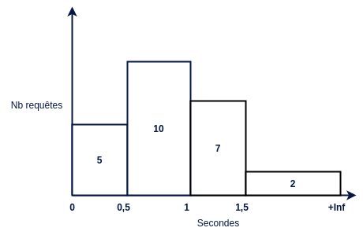

# Découverte de Prometheus

Prometheus est un outil de surveillance applicative très connu dans le monde de l'observabilité.

 

 

Prometheus fonctionne en mode `Pull`, il collecte les métriques à interval régulier auprès des applications à surveiller. 
Ces métriques sont ensuite enregistrées dans une base de données temporelles. 
Le langage **PromQL** permettra de requêter les données par le biais d'une API Rest.

On retrouve dans Prometheus :

- un outil pour collecter les métriques.
- une base de données temporelles (Time Series DataBase).
- un langage de requête (PromQL).
- une API Rest pour exécuter les requêtes et gérer la plateforme.
- une interface graphique pour visualiser les données.

Il est recommandé d'utiliser **Grafana** pour l'affichage des données. 
L'interface minimaliste de Prometheus sera utilisée uniquement dans la phase de développement pour tester des requêtes PromQL.

## Les métriques

Une métrique est une mesure numérique d'un élement de l'application, par exemple la quantité de mémoire RAM utilisée.  
Elles se déclinent  principalement en quatre types.

**Compteur**

La valeur d'un compteur peut **uniquement être incrémentée**.

<u>Exemple</u> : Nombre de requêtes HTTP executées par un serveur web.

 

 

**Jauge**

La valeur d'une jauge peut **augmenter ou diminuer**.

<u>Exemple</u> : Température d'un processeur en degré celcius.

 

 

**Histogramme**

Un histogramme compte le nombre de données selon certaines catégories prédéfinies.

<u>Exemple</u> : Durée d'exécution des requêtes HTTP.

 

 

10 requêtes ont un temps d'exécution compris entre 0,5 et 1 seconde.

Le nombre de requêtes de chaque catégorie augmentera au cours du temps. Comme pour un compteur, cette valeur ne pourra pas diminuer.

**Résumé**

Un résumé permet de calculer la valeur de certains quantiles.

<u>Exemple</u> : Durée d'exécution des requêtes HTTP.

 

 

Au vu du dernier résultat, on déduit que le temps d'exécution d'une requête est inférieur ou égal à 650ms pour au moins 99% d'entre elles.

Le quantile de niveau q (0 <= q <= 1) d'une série ordonnée d'éléments permet d'évaluer la valeur d'un élément à certain rang de la série. 

Par exemple, le quantile 0,5 également appelé médiane permet de séparer une série en deux parties. Sa valeur, contrairement à la moyenne, ne sera pas affectée par des valeurs disproportionnées présentes dans le jeu de données.

 

## Format des métriques

Les applications doivent exposer leurs métriques par le biais d'un service HTTP de type GET.  
Ce service retournera l'intégralité des métriques dans un format texte compréhensible par Prometheus.

<b>Compteur</b>

Chaque ligne (excepté les en-têtes) définit une nouvelle série temporelle qui est identifiée par son **nom** et éventuellement des **libellés** de type clé-valeur. Une métrique correspond donc à un ensemble de séries temporelles.

Par convention, le nom d'un compteur se terminera toujours par `_total`.

<b>Jauge</b>

La première jauge `process_resident_memory_size` indique la taille mémoire occupée par le processus. Cette valeur pourra augmenter ou diminuer.

Une jauge peut également servir à stocker une constante, c'est le cas de `process_start_time_seconds` qui indique la date de démarrage du processus.

Une métrique doit obligatoirement avoir un nom. Elle peut en revanche ne pas avoir de libellés, c'est le cas pour ces deux jauges.   

<b>Histogramme</b>

Un histogramme est composé de plusieurs séries temporelles. 

On a dans un premier temps les séries correspondantes aux catégories de l'histogramme. Leur nom se termine par `_bucket`. Chacune de ces séries contient obligatoirement le libellé `le` (lower or equal). 

La première catégorie nous indique que 309 requêtes ont eu une durée d'exécution inférieure ou égale 0,1s. 

Les valeurs présentent dans ces catgégores sont cummulatives, on en déduit que 2 requêtes ont eu une durée d'exécution comprise entre 0,1s et 0,2s. 
La derniere catégorie possède obligatoirement le libellé `le="+Inf"`.

On trouve enfin deux séries contenant la somme et le nombre des valeurs enregistrées. 311 requêtes ont été exécutées pour une durée totale de 1,55s. Ces données nous permet de calculer la moyenne.

Chaque service (identifié par le libellé `handler`) contiendra ce même ensemble de séries. J'ai affiché ici uniquement celles liées au service `/metrics`.

<b>Résumé</b>

Chaque série liée au calcul d'un quantile possède le libellé `quantile`. Prometheus est configuré par défaut pour récupérer les métriques toutes les 15 secondes, les valeurs des quantiles pour cet interval sont donc très proches de 15.

Comme pour l'histogramme, deux séries contiennent la somme et le nombre de valeurs enregistrées.

Les quantiles sont calculés par l'application cliente à chaque nouvel enregistrement.  
Pour obtenir leur valeur exacte, il faudrait garder en mémoire l'intégralité du jeu de données, ce qui est inenvisageable pour une application ayant une durée de vie importante.  

Un algorithme est utilisé pour éliminer certaines données au fil du temps. Les calculs des quantiles sont donc effectués en intégrant une marge d'erreur.

## Exposition des métriques

Pour obtenir les métriques d'une application, on peut :

- utiliser un exporter qui va venir s'intégrer à celle-ci.

- déclarer ses propres métriques en ajoutant du code à l'application.  Prometheus fournit des libraries dans plusieurs langages pour déclarer et exporter des métriques.

Les exporters permettent d'observer un système existant sans avoir à ajouter le moindre code.

* `Node exporter` expose les métriques d'un système Linux.
* `JMX exporter` expose les métriques d'une application Java en se basant sur les données disponibles via JMX.
* `PostgreSQL exporter` expose les métriques d'une base PostgreSQL

À noter que le serveur Prometheus expose des métriques, il peut donc s'observer lui-même.

