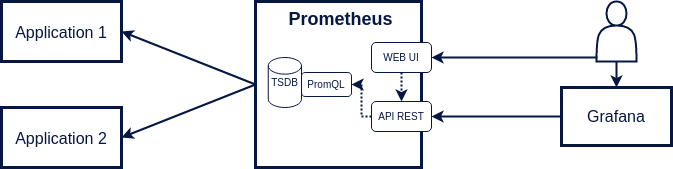
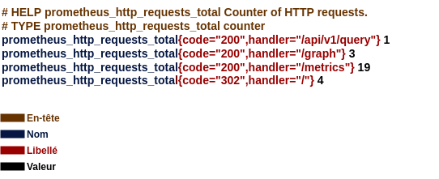

# Découverte de Prometheus

Prometheus est un outil de surveillance applicative très connu dans le monde de l'observabilité. 
Je présenterai dans cet article son fonctionnement global en insistant sur la partie requêtage de données avec le langage PromQL.

 

 

Prometheus fonctionne en mode `Pull`, il collecte les métriques à interval régulier auprès des applications à surveiller. 
Ces métriques sont ensuite enregistrées dans une base de données temporelles. 
Le langage **PromQL** permettra de requêter les données par le biais d'une API Rest.

On retrouve dans Prometheus :

- un outil pour collecter les métriques.
- une base de données temporelles (Time Series DataBase).
- un langage de requête (PromQL).
- une API Rest pour exécuter les requêtes et gérer la plateforme.
- une interface graphique pour visualiser les données.

Il est recommandé d'utiliser **Grafana** pour l'affichage des données. 
L'interface minimaliste de Prometheus sera utilisée uniquement dans la phase de développement pour tester des requêtes PromQL.

## Les métriques

Une métrique est une mesure numérique d'un élement de l'application, par exemple la quantité de mémoire RAM utilisée.  
Elles se déclinent  principalement en quatre types.

**Compteur**

La valeur d'un compteur peut **uniquement augmenter** au cours du temps.

<u>Exemple</u> : Nombre de requêtes HTTP executées par un serveur web.

 

 

**Jauge**

La valeur d'une jauge peut **augmenter ou diminuer**.

<u>Exemple</u> : Température d'un processeur.

 

 

**Histogramme**

Un histogramme compte le nombre de données selon certaines catégories prédéfinies.

<u>Exemple</u> : Durée d'exécution des requêtes HTTP.

 

 

10 requêtes ont un temps d'exécution compris entre 0,5 et 1 seconde.

Le nombre de requêtes de chaque catégorie augmentera au cours du temps. Comme pour les compteurs, cette valeur ne pourra pas diminuer.

**Résumé**

Un résumé permet de déterminer la valeur de certains quantiles.

<u>Exemple</u> : Durée d'exécution des requêtes HTTP.

 

 

Au vu du dernier résultat, on déduit que le temps d'exécution d'une requête n'excède pas 650ms pour 99% d'entre elles.

## Format des métriques

Les applications doivent exposer leurs métriques par le biais d'un service HTTP de type GET.  
Ce service retournera l'intégralité des métriques dans un format texte compréhensible par Prometheus.

<b>Compteur</b>

Chaque ligne (excepté les en-têtes) définit une nouvelle série temporelle qui est identifiée par le **nom de la métrique** et des **libellés** de type clé-valeur.

Par convention, le nom d'un compteur se terminera toujours par `_total`.

<b>Jauge</b>

La première jauge `process_resident_memory_size` indique la taille en mémoire occupée par le processus. 

Une jauge peut également servir à stocker une constante, c'est le cas de `process_start_time_seconds` qui indique la date de démarrage du processus. Cette valeur ne bougera pas durant toute la durée de vie du processus.

Une métrique doit obligatoirement avoir un nom. Elle peut en revanche ne pas déclarer de libellés, c'est le cas des deux précédentes jauges.   

<b>Histogramme</b>

Un histogramme est composé de plusieurs séries temporelles. 

On a dans un premier temps les séries liées aux buckets (se terminant par `_bucket`) qui correspondent aux catégories de l'histogramme. Chaque bucket contient obligatoirement le libellé `le`. 

Le premier bucket nous indique que 309 requêtes ont chacune eu une durée d'exécution inférieure ou égale 0,1s. 

Les valeurs présentent dans ces buckets sont cummulatives, on en déduit que 2 requêtes ont eu une durée d'exécution comprise entre 0,1s et 0,2s. 
Le dernier bucket possède obligatoirement le libellé `le="+Inf"` représentant ainsi la dernière catégorie.

On trouve ensuite deux séries qui correspondent à la somme et au nombre des valeurs enregistrées. 311 requêtes ont été exécutées pour une durée totale de 1,55s, ce qui nous permet de calculer le temps moyen d'exécution d'une requête.

Les valeurs de ces séries pourront uniquement augmenter au cours du temps. C'est le même principe que pour un compteur.

Chaque service (identifié par le libellé `handler`) contiendra ce même ensemble de séries. J'ai affiché ici uniquement celles liées au service `/metrics`.

<b>Résumé</b>

Les valeurs des quantiles sont ici toutes très proches de 15 étant donné que l'interval entre chaque appel au service de récupération des métriques est configuré à 15 secondes.

Comme pour l'histogramme, les 2 dernières séries correspondent à la somme et au nombre de valeurs enregistrées.

Les quantiles sont calculés côté client. En effet pour déterminer leur valeur, nous avons en théorie besoin de l'ensemble des données enregistrées. Prometheus fonctionne en mode `Pull`, l'application cliente n'a aucun moyen de le contacter pour lui transmettre chaque nouvelle donnée.  

C'est donc l'application elle-même qui pour chaque nouvelle donnée va recalculer la valeur des différents quantiles. 

Un algorithme sera utilisé pour éliminer des données au cours du temps. La sauvegarde de l'intégralité de ces données deviendrait problématiqué à partir d'un certain temps. Un nombre restreint de données est ainsi sauvegardé en mémoire permettant ainsi le calcul des quantiles en intégrant une marge d'erreur.

## Exposition des métriques

Pour obtenir les métriques d'une application, on peut :

- utiliser un exporter qui va venir se greffer à celle-ci et exposer des métriques utiles à son observation.

- déclarer ses propres métriques en ajoutant du code. Pour cela, Prometheus fournit une librarie cliente disponible dans plusieurs langages.

Il est donc possible grâce aux exporters d'observer une application existante sans avoir à ajouter le moindre code.

On retrouve par exemple le `Node Exporter` qui expose les métriques d'un système Linux, le `JMX Exporter` qui expose les métriques d'une application Java en se basant sur les données disponibles via JMX.

Notons que le serveur Prometheus expose lui-même des métriques accessibles via le path `/metrics`.
